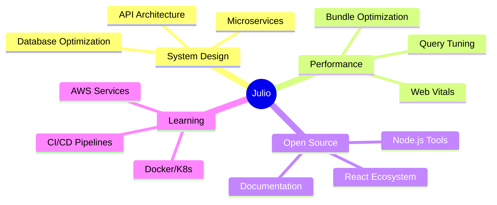

<div align="center">
  <h1>Hi there, I'm Julio Matos 👋</h1>
  
  <p>
    <a href="https://git.io/typing-svg">
      
    </a>
  </p>
</div>

---

## 🚀 About Me

Full-Stack Engineer with **3+ years** of professional experience building responsive interfaces and scalable REST APIs. Former **TEK Systems** contractor specializing in React, TypeScript, Node.js, and MySQL optimization.

- 💼 Currently working as a **Full-Stack Developer**
- ⚡ **Reduced API response times by ~30%** through database optimization
- 🎨 **Improved Lighthouse scores from 3.8s → 1.9s** refactoring WordPress to React
- 🏗️ Built production-ready authentication systems, e-commerce dashboards, and real-time apps
- 🌱 Continuously learning: microservices architecture, DevOps, and system design
- 👯 Open to collaboration on full-stack projects and open source
- 🎯 **2025 Goals:** Contribute to 5+ OSS projects • Build microservices demos • Write technical articles

---

## 💼 Professional Highlights

```javascript
const julioMatos = {
  experience: "3+ years",
  companies: ["TEK Systems", "Inertia Marketing & Design", "1SEO Digital Agency"],
  achievements: [
    "30% faster API response times",
    "Improved Lighthouse from 3.8s to 1.9s",
    "Built modular REST APIs with Express + MySQL",
    "Delivered features in 2-week Agile sprints",
    "Enhanced Core Web Vitals across client sites"
  ],
  currentFocus: ["System Design", "Performance Optimization", "Open Source"]
};
```

---

## 🛠️ Tech Stack

### Frontend


### Backend


### DevOps & Tools


### Testing & Quality


---

## 🏆 Featured Projects

### 🔐 [Full-Stack Authentication System](https://github.com/julmtoz/secure-auth-system)
> **React • TypeScript • Node.js • Express • MySQL • JWT**

Secure authentication with encrypted passwords, JWT refresh tokens, and role-based access control.

**Key Features:**
- ✅ bcrypt password hashing
- ✅ Access & refresh token rotation
- ✅ Protected routes with middleware
- ✅ Role-based permissions (Admin/User)
- ✅ Input validation with Joi
- ✅ 80%+ test coverage


---

### 🛒 [E-Commerce Admin Dashboard](https://github.com/julmtoz/ecommerce-admin-dashboard)
> **React • TypeScript • Node.js • MySQL • Tailwind CSS**

Full-featured admin dashboard with product management, analytics, and optimized SQL queries.

**Highlights:**
- ⚡ Reduced query time from 800ms → 120ms using indexes
- 📊 Handles 10K+ products with efficient pagination
- 🖼️ Image optimization reducing load by 60%
- 📈 Real-time sales analytics


---

### 📋 [Real-Time Task Manager](https://github.com/julmtoz/realtime-task-manager)
> **React • TypeScript • Node.js • WebSockets • MySQL**

Kanban-style task board with drag-and-drop, real-time updates, and role-based permissions.

**Features:**
- 🎯 Real-time collaboration with WebSockets
- 👥 Role-based access (Admin/Manager/User)
- 📱 Fully responsive mobile design
- 🔔 Push notifications for updates


---

## 📊 GitHub Statistics

<div align="center">
  
  
</div>

<div align="center">
  
</div>

---

## 📈 Contribution Activity

<div align="center">
  
</div>

---

## 🎯 Current Focus Areas



---

## 📝 Latest Projects & Contributions

| Project | Tech Stack | Status | Last Updated |
|---------|-----------|--------|--------------|
| [**Secure Auth System**](https://github.com/julmtoz/secure-auth-system) | React, Node.js, MySQL, JWT | 🟢 Active |  |
| [**E-Commerce Dashboard**](https://github.com/julmtoz/ecommerce-admin-dashboard) | React, TypeScript, MySQL | 🟢 Active |  |
| [**Task Manager**](https://github.com/julmtoz/realtime-task-manager) | React, WebSockets, Node.js | 🟢 Active |  |
| [**WordPress React Migration**](https://github.com/julmtoz/wordpress-react-migration) | React, WordPress API | 🟡 In Progress |  |

---

## 💡 Technical Skills Breakdown

<div align="center">

| Category | Skills | Proficiency |
|----------|--------|-------------|
| **Frontend** | React, TypeScript, JavaScript (ES6+) | ████████░░ 80% |
| **Backend** | Node.js, Express, REST APIs | ████████░░ 85% |
| **Database** | MySQL, Schema Design, Optimization | █████████░ 90% |
| **DevOps** | Git, Docker, CI/CD, AWS | ███████░░░ 70% |
| **Testing** | Jest, Supertest, Unit/Integration | ████████░░ 75% |

</div>

---

## 🏅 Certifications & Education

🎓 **Bachelor of Science in Computer Science** - Stockton University (2018-2021)
- GPA: 3.89 | Magna Cum Laude
- Senior Capstone: Full-stack API design and web application development

---

## 📫 Connect With Me

<div align="center">
  
[](https://www.linkedin.com/in/julio-matos-nunez/)
[](mailto:matosnunezj@gmail.com)
[](https://your-portfolio.com)
[](https://github.com/julmtoz)

</div>

---

## 🌟 Quick Facts

- 🔭 **3+ years** of professional full-stack development experience
- 💻 Built **production applications** serving thousands of users
- 📈 Consistently delivered features in **Agile 2-week sprints**
- 🎯 Passionate about **performance optimization** and **clean code**
- 🌍 **Bilingual:** English & Spanish
- 📍 Based in **Orange, New Jersey**

---

<div align="center">
  
### 💼 Open to Full-Time Opportunities | Contract Work | Collaboration

**Mid-Level Full-Stack Engineer positions** specializing in React, Node.js, and MySQL

---


</div>

---

<div align="center">
  
</div>
